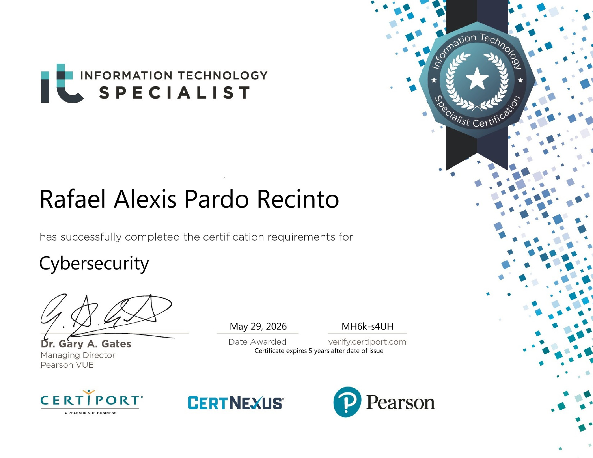

 

# RAFAEL ALEXIS RECINTO
◈ CODENAME <code>@moppikyu</code> ◈

 

| CLASS | STATUS | INSTITUTION |
|:---:|:---:|:---:|
| `Front-line Dev · AI Integrator` | `4th Year, BSIT` | `National University Manila` |

░░░░░░░░░░░░░░░░░░░░░░░░░░░░░░░░░░░░░░░░░░░░░░░░░░░░░░░░░░░░░░░░░░░░

## ▌ 01 — DOSSIER

> **CURRENT DIRECTIVE** — Developing **VisioSphere**, an end-to-end system pairing a Flutter/MERN interface with real-time AI inference.
>
> **SECONDARY DIRECTIVE** — Training **YOLOv8** models for computer vision applications, with development workflows optimized through AI-assisted engineering.

 

## ▌ 02 — LOADOUT

 

## ▌ 03 — CLEARANCE / CREDENTIALS

  

**Information Technology Specialist — Cybersecurity**
Certiport · A Pearson VUE Business
Issued May 2026 · Expires May 2031 · Credential ID `MH6k-s4UH`

[**Verify Credential →**](https://verify.certiport.com)

 

## ▌ 04 — COMMS CHANNEL

░░░░░░░░░░░░░░░░░░░░░░░░░░░░░░░░░░░░░░░░░░░░░░░░░░░░░░░░░░░░░░░░░░░░

## ▌ 05 — SYSTEM METRICS

 

— END OF FILE —

